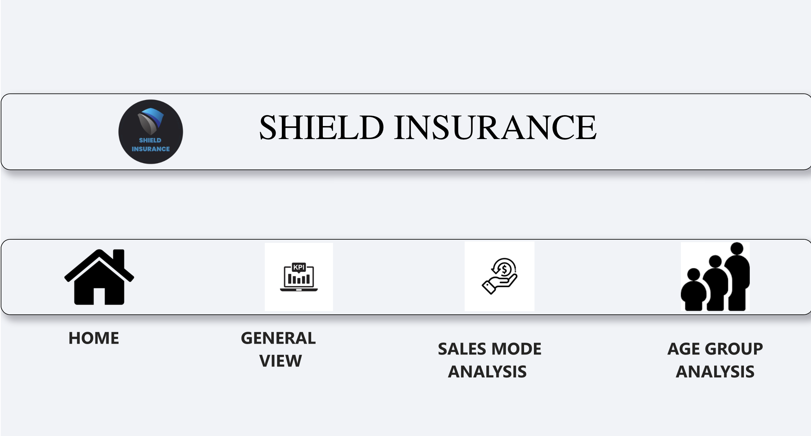

# My Portfolio
---
## Social Buzz

An analysis of various types of contents ranging from text, images, videos and GIFs posted online daily.

## Game Sales Prediction

An analysis of sales of famous video games and the attributes contributing to the success of the top selling video games.

## Shield Insurance

An analysis of an insurance company which will closely monitor the progress and make informed decisions for the company's success.

## Shield Insurance

An analysis for the sales team which will help them to evaluate customer performance and understand their market performance with respect to their target.

